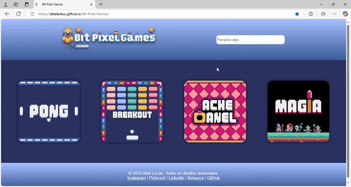
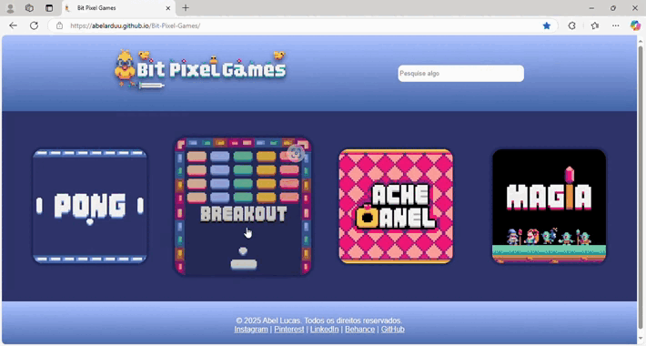
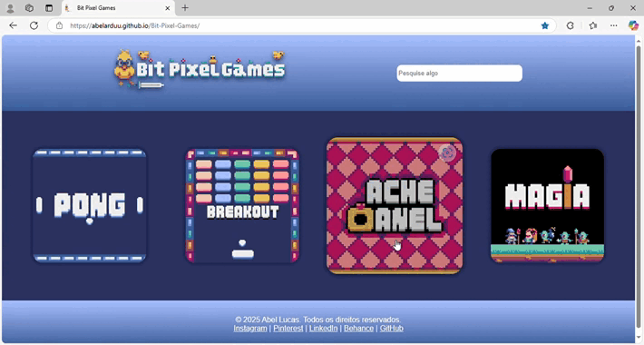

 
# Bit Pixel Games

### Sobre o projeto
Bem-vindo ao **Bit Pixel Games**! Este é um site de jogos que funciona como meu portfólio, reunindo todos os jogos que desenvolvi utilizando a game engine **Pyxel** em **Python**. Aqui, você pode explorar jogos com design e jogabilidade nostálgicos, criados inteiramente por mim, desde o conceito até os detalhes finais de programação.

O site foi feito com muita dedicação e criatividade, englobando desde a programação até o design visual com **HTML** e **CSS**. Ele reflete minha paixão por criar experiências interativas e compartilhar meu trabalho com o mundo. A cada novo jogo que eu desenvolver, ele será adicionado a este espaço, ficando disponível para livre acesso e exploração.

## Jogos incluídos

Cada jogo possui um repositório no GitHub com informações detalhadas sobre o projeto. Confira os links abaixo para saber mais:  
- Pong ( [Link do repositorio](https://github.com/abelarduu/pong) )  
- Breakout( [Link do repositorio](https://github.com/abelarduu/breakout) ) 
- Ache o Anel( [Link do repositorio](https://github.com/abelarduu/ache-o-anel) )
- Magia( [Link do repositorio](https://github.com/abelarduu/magia) )

### Resultado

